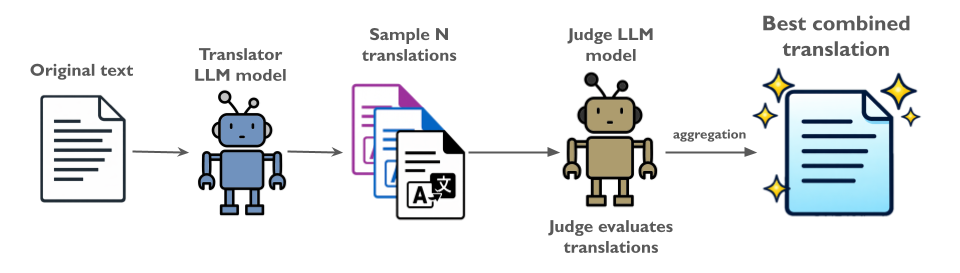
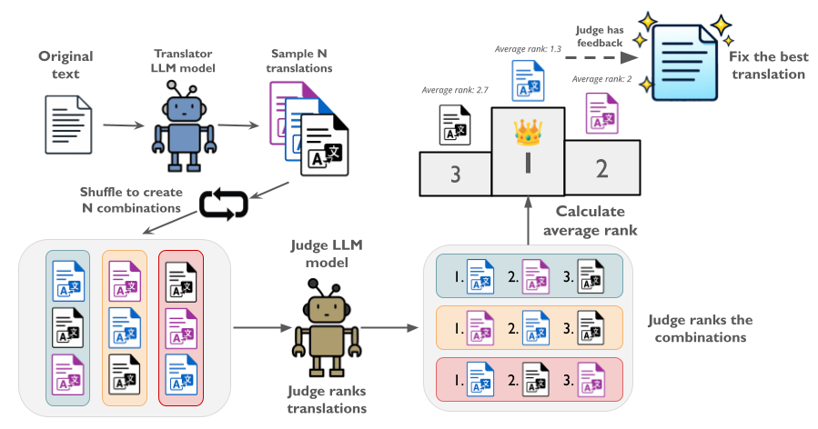

# Recovered in Translation

[](https://arxiv.org/abs/2602.22207)
[](https://github.com/insait-institute/ritranslation)
[](https://hf.co/collections/INSAIT-Institute/multilingual-benchmarks)

This repository contains the official implementation of the paper *"Recovered in Translation: Efficient Pipeline for Automated Translation of Benchmarks and Datasets"*.

## Authors

[Hanna Yukhymenko](https://ayukh.com/) | [Anton Alexandrov](https://insait.ai/anton-alexandrov/) | [Martin Vechev](https://www.sri.inf.ethz.ch/people/martin)

## Abstract

The reliability of multilingual Large Language Model (LLM) evaluation is currently compromised by the inconsistent quality of translated benchmarks. Existing resources often suffer from semantic drift and context loss, which can lead to misleading performance metrics. In this work, we present a fully automated framework designed to address these challenges by enabling scalable, high-quality translation of datasets and benchmarks. We demonstrate that adapting test-time compute scaling strategies, specifically Universal Self-Improvement (USI) and our proposed multi-round ranking method, T-RANK, allows for significantly higher quality outputs compared to traditional pipelines. By effectively applying these methods, our framework ensures that benchmarks preserve their original task structure and linguistic nuances during localization. We apply this approach to translate popular benchmarks and datasets into eight Eastern and Southern European languages. Evaluations using both reference-based metrics and LLM-as-a-judge show that our translations surpass existing resources, resulting in more accurate downstream model assessment. We release both the framework and the improved benchmarks to facilitate robust and reproducible multilingual AI development.

## Overview

We provide a novel automated translation framework supporting four methods across various model types, including open-weight models. The framework facilitates machine translation of datasets and benchmarks with minimal manual supervision and maximum configurability.

**Supported Languages**: Bulgarian, Estonian, Greek, Lithuanian, Romanian, Slovak, Turkish, Ukrainian

**Supported Benchmarks**: MMLU, Hellaswag, ARC, Winogrande

**Supported Datasets**: FLORES, WMT24++

**Supported Model Providers**: OpenAI, Google Gemini, TogetherAI, OpenRouter, Local vLLM

Our setup allows easy addition of new languages and benchmarks to the task configuration together with the diversity of translation methods ensuring flexibility in finding the perfect fit for your translation task.

---

## Installation

### Requirements

- Python 3.9+
- CUDA (optional, for local vLLM inference)

### Setup

1. Clone the repository:

```bash
git clone https://github.com/insait-institute/ritranslation.git
cd ritranslation
```

2. Install dependencies:

```bash
pip install -r requirements.txt
```

3. Configure API credentials by creating a `credentials.py` file in the root folder:

```python
open_api_key = '<your_OpenAI_API_key>'
hf_token = '<your_Hugging_Face_token>'
google_api_key = '<your_Gemini_API_key>'
together_api_key = '<your_TogetherAI_API_key>'
openrouter_api_key = '<your_OpenRouter_API_key>'
```

> **Note**: Leave unused API keys as empty strings (`''`).

---

## Translation Methods

Our framework incorporates four translation methods with different quality/cost tradeoffs:

### Self-Correction (SC)

Classic one-prompt translation with optional self-correction as a lightweight solution. The model translates the text, then optionally evaluates and corrects the result in a new chat without history.

```
Source Text → LLM Translation → (Optional) Self-Correction → Final Translation
```

**Best for**: Large text translation into high-resource languages where translation capabilities are sufficient.

### Best-of-N Sampling (BoN)

Samples N translation candidates at higher temperature (0.7) for diversity, then prompts the LLM to score candidates 1-10 based on specified criteria, selecting the highest-scored translation.

```
Source Text → N Candidate Translations → LLM Scoring → Highest Score Selected
```

**Best for**: Cost-effective translation when language-agnostic approach is needed or if you have a judge model trained to quality scoring available.

### Universal Self-Improvement (USI)

Building on Universal Self-Consistency and Fusion-of-N, this method samples N candidate translations using higher temperature, then presents them to an evaluator LLM with instructions to combine the candidates into the best version according to specified criteria. Requires only N + 1 model calls per entry.

<p align="center">
  
</p>

**Best for**: Short and simple dataset translation; cost-efficient for lower-resource languages.

### Translation Ranking (T-RANK)

Our proposed method that employs multi-prompt candidate sampling and multi-round competitive ranking to enhance error detection. Candidates are systematically presented in different positional orders across rounds to reduce positional bias. After ranking, the judge model corrects and refines the selected translation candidate. Requires 2N + 1 model calls.

<p align="center">
  
</p>

**Best for**: Benchmark translation with complex question structures and specific domain terminology; highest quality when cost is not a primary concern.

---

## Quick Start

### Translate a Dataset

```bash
python run.py --config_path configs/dataset/WMT/dataset_wmt_uk.yaml
```

### Translate a Benchmark

```bash
python run.py --config_path configs/benchmark/MMLU/bench_mmlu_bg.yaml
```

---

## Configuration

All translation jobs are configured via YAML files located in the `configs/` directory.

### Benchmark Configuration Example

```yaml
task: "BENCHMARK"
output_dir: "src/benchmark/data"

translation_model:
  name: "gpt-4o-mini-2024-07-18"
  provider: "openai"

judge_model:
  name: "gpt-4o-mini-2024-07-18"
  provider: "openai"

task_config:
  benchmark:
    name: "cais/mmlu"
    subset: ["all"]
    split: ["test"]
    n_entries: null

  target_language: "Ukrainian"
  method: "TRANK"                # SC, USI, BoN, TRANK
  temperature_translator: 0.5
  temperature_judge: 0.1
  max_workers: true
  num_workers: 4
  n_samples: 5
  question_fields: ["question"]
  answer_fields: ["choices"]
  agent_check: false
  few_shot: false
  multi_prompt: false
```

### Dataset Configuration Example

```yaml
task: "DATASET"
output_dir: "src/dataset/data/flores/bg"

translation_model:
  name: "gpt-4o-mini-2024-07-18"
  provider: "openai"

task_config:
  dataset:
    name: "gsarti/flores_101"
    subset: ["eng"]
    split: ["devtest"]

  target_language: "Bulgarian"
  method: "TRANK"
  fields: ["sentence"]
  temperature_translator: 0.5
  n_samples: 5
```

### Supported Model Providers

| Provider | Example Model | Config |
|----------|--------------|--------|
| OpenAI | `gpt-4o-mini-2024-07-18` | `provider: "openai"` |
| Google Gemini | `gemini-2.0-flash` | `provider: "google"` |
| TogetherAI | `meta-llama/Meta-Llama-3.1-70B-Instruct-Turbo` | `provider: "together"` |
| OpenRouter | `anthropic/claude-3-sonnet` | `provider: "openrouter"` |
| Local vLLM | Custom model | `provider: "vllm"` |

TODO: add Cohere API👀

---

## Project Structure

```
├── run.py                      # Main entry point
├── credentials.py              # API credentials (create this)
├── requirements.txt            # Dependencies
│
├── configs/                    # Configuration files
│   ├── benchmark/              # Benchmark configs (ARC, Hellaswag, MMLU, Winogrande)
│   └── dataset/                # Dataset configs (FLORES, WMT)
│
└── src/
    ├── initialization.py       # Config parsing (Pydantic validation)
    ├── translate_benchmark.py  # Benchmark translation pipeline
    ├── translate_dataset.py    # Dataset translation pipeline
    │
    ├── benchmark/
    │   ├── methods.py          # SC, USI, BoN, T-RANK implementations
    │   ├── model_factory.py    # Multi-provider LLM interface
    │   ├── utils.py            # Prompt loading, text processing
    │   ├── save_to_hf.py       # HuggingFace Hub upload
    │   ├── prompts/            # Prompt templates
    │   └── eval_mmlu/          # Evaluation scripts (COMET, LLM-judge)
    │
    ├── dataset/
    │   ├── methods.py          # Dataset translation methods
    │   ├── model_factory.py    # LLM interface
    │   ├── utils.py            # Utilities
    │   └── prompts/            # Prompt templates
    │
    └── common_utils/
        └── serve_local_vllm.sh # Local vLLM server script
```

---

## Evaluation

The framework includes multiple evaluation methods:

### COMET Evaluation (Reference-based)

```bash
python src/benchmark/eval_mmlu/evaluate_translations_comet.py
```

### Quality Estimation (Reference-free)

```bash
python src/benchmark/eval_mmlu/evaluate_mmlu_comet_qe.py
```

### LLM-as-Judge Evaluation (MMLU)

```bash
python src/benchmark/eval_mmlu/evaluate_translations_llm_judge.py
```

### Manual Evaluation & Correction of examples (Gradio Interface)

```bash
python src/benchmark/eval_mmlu/manual_evaluation.py
```

---

## Results

Our methods demonstrate substantial improvements on WMT24++ and FLORES benchmarks:

| Method | WMT24++ | FLORES |
|--------|---------|--------|
| Baseline | 0.827 | 0.937 |
| SC (with check) | 0.821 | 0.937 |
| Best-of-N (n=5) | 0.843 | 0.943 |
| USI (n=5) | 0.843 | **0.945** |
| T-RANK (p=5) | **0.845** | 0.940 |

*COMET reference-based scores for EN→UK translation with GPT-4o-mini, where n denotes number of samples candidates from the same prompts and p denotes number of different prompts used to sample 1 candidate*

LLM-as-a-judge evaluation shows our T-RANK translations significantly outperform Global-MMLU:

| Translation | Wins | Draws | Losses |
|------------|------|-------|--------|
| Global-MMLU-UK | 2016 | 3276 | 8750 |
| T-RANK (ours) | **8750** | 3276 | 2016 |

---

## Adding New Languages

1. **Create language-specific prompts** in `src/benchmark/prompts/mq_base_translation_prompts/<language>/`

2. **Create few-shot examples** (optional) in `src/benchmark/prompts/few_shot_*.txt`

3. **Create configuration files** in `configs/` by copying an existing config and updating `target_language`

---

## License

This project is released under the MIT License.

---

## Acknowledgements

This work was done during a Master's thesis at INSAIT, Sofia University "St. Kliment Ohridski".

## Citation

If you find this work useful, please cite:

```bibtex
@article{yukhymenko2026recovered,
  title={Recovered in Translation: Efficient Pipeline for Automated Translation of Benchmarks and Datasets},
  author={Yukhymenko, Hanna and Alexandrov, Anton and Vechev, Martin},
  journal={arXiv preprint arXiv:2602.22207},
  year={2026}
}
```

## Contact

For questions or issues, please open an issue on [GitHub](https://github.com/insait-institute/ritranslation/issues) or contact: hanna.yukhymenko@insait.ai 